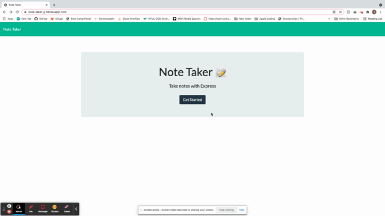

# Note-Taker  
                       
## Description
Note application that saves entered notes in a database. Notes can be added or deleted.

## Table of Contents
- [Installation](#installation)
- [Usage](#usage)
- [Credits](#credits)
- [Tests](#Tests)
- [License](#license)
- [Questions](#questions)

## Installation
<h3>Clone Github repositiory </h3>
<ul> <li> In root directory, enter command <b> npm i </b> </li>
<li> Then command <b> node server.js </b> </li>
<li> Website will be deployed at <a href="https://localhost:3001">https://localhost:3001 </li> </ul>

<h3>Heroku App </h3>
<ul> <li> Navigate to <a href ="https://note-taker-jj.herokuapp.com/notes"> Heroku Deployed App </a> </li> </ul>
    
## Usage
Select the note tile or text to begin typing.  
After typing, click the save icon in the top right to save the note.   
Click the trash can to delete a note.  
Select saved notes to view entry.

## License 
<h3> MIT: </h3>
<ul> <li> <a href = "https://opensource.org/licenses/MIT"> MIT License </a></li> <li> This project is licensed under MIT</li> </ul>

## Questions
<ul> <li><a href = "https://github.com/janeijones">GitHub Profile </li>
<li> <a href = "https://https://note-taker-jj.herokuapp.com/notes">Visit Deployed Heroku Website</li>
